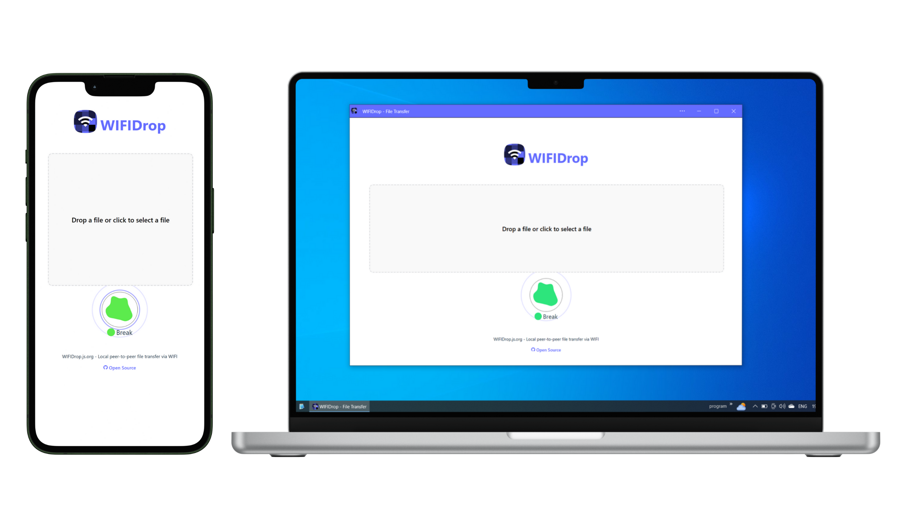

# WIFIDrop

Local peer-to-peer file transfer via WIFI.

WIFIDrop is an easy-to-use progressive web app (PWA) that allows users to transfer large files between devices over the same WIFI network. Files are transferred securely peer-to-peer via WebRTC without any intermediary servers. Therefore this application is a completely client side application and can be deploy on any static hosting or localhost.



## Features

* ✅ Support P2P direct connection whenever possible.
* ✅ No need to create an account or register.
* ✅ Automatically discover devices on the same WIFI network.
* ✅ Transfer large files between devices.
* ✅ Copy paste from the clipboard between devices.
* ✅ Secured by built-in WebRTC end-to-end encryption.

## Try it out!

* Go to a deployed WIFIDrop web app at : [https://wifidrop.js.org](https://wifidrop.js.org) .
* Open the app on another device on the same WIFI network.
* Both your devices should show up.
* Now start sharing some files.

## Development

```
git clone https://github.com/nuzulul/wifidrop.git
cd wifidrop
npm install
npm start
```

## Build

```
npm run build
```

A new build of WIFIDrop PWA will now be available in the `/dist` directory that you can self-hosted on static hosting.

## Install

Online : [https://wifidrop.js.org](https://wifidrop.js.org)

Android : [https://play.google.com/store/apps/details?id=org.js.wifidrop](https://play.google.com/store/apps/details?id=org.js.wifidrop)

Windows : [https://apps.microsoft.com/detail/9MVN98K4BBWC](https://apps.microsoft.com/detail/9MVN98K4BBWC)

Linux : [https://snapcraft.io/wifidrop](https://snapcraft.io/wifidrop) - `snap install wifidrop`

NPM : [https://www.npmjs.com/package/wifidrop](https://www.npmjs.com/package/wifidrop) - `npm install -g wifidrop`

cURL : `curl -o- https://raw.githubusercontent.com/nuzulul/wifidrop/refs/tags/0.1.0/tools/util/install.sh | bash`

Wget : `wget -qO- https://raw.githubusercontent.com/nuzulul/wifidrop/refs/tags/0.1.0/tools/util/install.sh | bash`

Self-hosted : [https://github.com/nuzulul/wifidrop](https://github.com/nuzulul/wifidrop)

Releases : [https://github.com/nuzulul/wifidrop/releases](https://github.com/nuzulul/wifidrop/releases)

## License

[GPL-3.0](https://github.com/nuzulul/wifidrop/blob/main/LICENSE)

## Maintainer

[Nuzulul Zulkarnain](https://github.com/nuzulul)